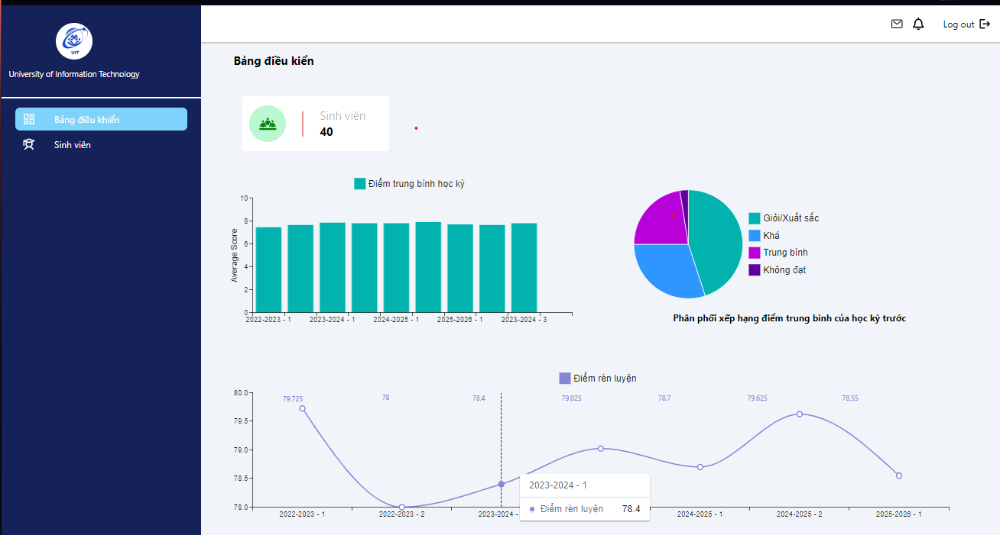
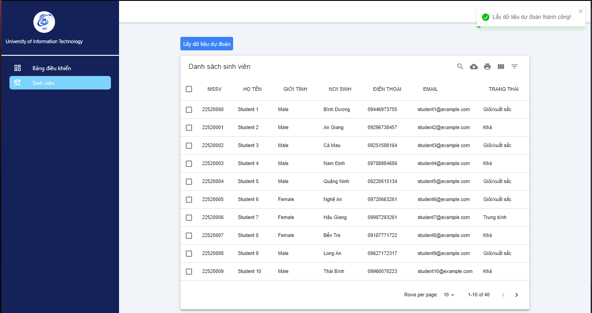
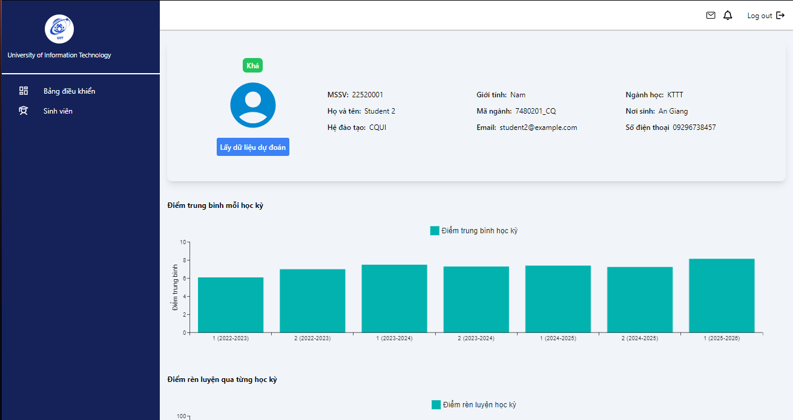

# DS317-data-mining-for-enterprise

# TTAUGG: Tabular and Time Series approach for UIT student graduation grade.

---

## 1. Project overview

---

This repository provides an in-depth understanding of the project and its core components. It includes a detailed introduction, outlining the purpose, scope, and expected outcomes. By reading through this document, you will gain insight into the project's objectives, the problems it addresses, and the solutions it proposes.

We want to give many thank to lecture **NGUYEN THI ANH THU** for giving us meaningful advices and instruction through out the course.

Team members:

| Student name | ID |
| --- | --- |
| Nguyen Vo Tien Loc | 22520792 |
| Truong Hoai Bao | 22520126 |
| Pham Van Duy | 22520341 |
| Nguyen Quang Dang | 22520191 |

## 2. Data description

- Data entries in our dataset cover the period the period between 2013 and 2019 of UIT student performance. 

- The above dataset contains 5181 entries including **1280, 2645, 933, 323** entries in (Excellent, Very Good), Good,Higher-Ordinary, Ordinary, Not Completed label respectively carefully extracted and verified from data preprocessing process from the raw dataset.

## 3. Our approach

The below image show the full process of addressing the problem:


## 4. Website

### Website Overview:

This project is a web-based application that integrates a predictive model for forecasting student graduation classification into a student data management system. The application is specifically designed to assist academic advisors in managing and analyzing student data for a specific class. By providing tools for data visualization and predictive analytics, the system enables advisors to monitor student performance and implement timely interventions for those at risk of poor outcomes.

### Key Features:

- **Student Information Management:** Manage comprehensive student information, including:
    - Student ID
    - Phone number
    - Email
    - Place of birth
    - Admission scores
    - Major
    - Academic department
    - Semester GPA (Grade Point Average)
    - Semester conduct scores
    - Other essential personal and academic details
- **Predictive Analytics:** Employ a trained model to predict graduation classifications based on historical and current data.
- **Business Intelligence (BI) Dashboard:** Provide professional BI tools for academic advisors to:
    - Visualize data through interactive charts and graphs.
    - Analyze trends in academic and conduct performance.
    - Identify students who require academic support.
- **Actionable Insights:** Help advisors design interventions based on predicted outcomes to improve student success rates.

## Application Interfaces

### 4.1. Login Interface

This screen provides a secure login system for authorized users. The interface includes:

- Fields for username and password input.
- A clean and intuitive design that ensures ease of use.


*A simple login page with a welcoming design, input fields for username and password, and a "Submit" button.*

### 4.2. Dashboard Interface

The dashboard provides a comprehensive overview of key data metrics. It includes:

- Interactive charts visualizing:
    - Average GPA trends over recent semesters.
    - Conduct scores for the latest semester.
    - Predicted academic performance classifications.



*A vibrant dashboard showing bar charts for GPA distribution, line graphs for conduct scores over time, and pie charts for predicted performance classifications. Dropdown menus and filters are available at the top for customization.*

### 4.3. Student List Interface

This interface displays a sortable and searchable table of student records, including:

- Basic student information:
    - Student ID
    - Name
    - Gender
    - Place oF birth
    - Phone number
    - Email
    - Status
- Pagination for ease of navigation.


*A tabular view with headers for Student ID, Name, Phone, and Email. Each row represents a student, with a search bar at the top for quick lookup.*



*This interface extends the basic student list by including a "Status" column, which displays predicted graduation classifications, predicted outcomes based on the trained model.*

### 4.5. Detailed Student Information Interface

This screen provides in-depth details about an individual student, including:

- Personal and academic information.
- Interactive charts visualizing:
    - GPA trends.
    - Conduct score variations.


*A profile page with sections for personal information, followed by a line chart of semester GPAs and a bar chart for conduct scores. The design is clean, with tabs for navigating different sections of the student’s profile.*



*Similar to the detailed profile interface but includes a highlighted section showing the predicted graduation classification. A pie chart or bar graph illustrates the key contributing factors.*

## Technologies Used

- **Frontend:** React.ts for a dynamic and responsive user interface.
- **Backend:** Node.js with Express for API management.
- **Database:** MongoDB for secure and structured data storage.
- **Machine Learning:** A predictive model trained using Python and integrated with the web application.
- **Visualization:** MUI  x Chart for interactive data visualization.

## 5. Setup instruction

### Backend Setup

1. Navigate to the `backend` directory.
    
    ```jsx
    cd .\web\academic-advisor-be
    ```
    
2. Install dependencies:
    
    ```
    npm install
    ```
    
3. Set up the MongoDB database:
    - Ensure MongoDB is running locally or provide a remote connection string in the `.env` file.
    - Example `.env` configuration:
        
        Connect us to get URI mongodb (dangnguyenquangit@gmail.com)
        
4. Start the backend server:
    
    ```
    npm start
    ```
    

### Frontend Setup

1. Navigate to the `frontend` directory.
    
    ```jsx
    cd .\web\academic-advisor-fe
    ```
    
2. Install dependencies:
    
    ```
    npm install
    ```
    
3. Start the development server:
    
    ```
    npm run dev
    ```
    
4. Access the frontend at `http://localhost:5173`.

### Model Setup

1. Navigate to the `model` directory.

```jsx
cd .\web\academic-advisor-be\python
```

1. Create a virtual environment:
    
    ```
    python -m venv venv
    source venv/bin/activate  # On Windows: venv\Scripts\activate
    ```
    
2. Install dependencies:
    
    ```
    pip install pandas matplotlib watchdog torch torchmetrics pytorch-lightning
    ```
    
3. Run the `processing.py` file to execute the model:

```jsx
python processing.py
```

## 6. References

[(PDF) Aggregating Time Series and Tabular Data in Deep Learning Model for University Students’ GPA Prediction](https://www.researchgate.net/publication/352343704_Aggregating_Time_Series_and_Tabular_Data_in_Deep_Learning_Model_for_University_Students%27_GPA_Prediction)